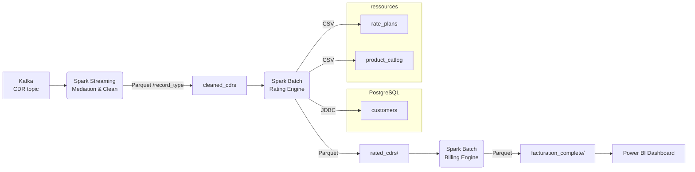

# 📡 Telecom Big-Data Pipeline – Mediation → Rating → Billing → Reporting

> **Goal:** Convert raw network usages (CDR/EDR) into reliable revenue and business KPIs  
> **Stack:** Kafka | Apache Spark (Structured Streaming + Batch) | PostgreSQL | Parquet | Power BI  

---

## 🌐 End-to-End Architecture

## 📂 Project Layout

project-root/
├─ conf/                                         # JARs  
├─ src/  
│  ├─ Synthetic_Data_Generation.py               # Générateur de CDR factices → Kafka  
│  ├─ Streaming_Mediation.py                     # Médiation Spark Structured Streaming  
│  ├─ RatingEngine.ipynb                         # Spark Batch (Rating Engine)  
│  ├─ BillingEngine.ipynb                        # Spark Batch (Billing Engine)  
│  ├─ kafka_streaming.py                         # Kafka Producer  
│  ├─ initialisation_pg.py                       # Initialisation PostgreSQL  
│  └─ reporting.ipynb                            # Job Spark → CSV pour BI  
├─ resources/  
│  ├─ product_catalog.csv  
│  └─ rate_plans.csv  
├─ cleaned_cdrs/                                 # Sortie Médiation (Parquet)  
├─ rated_cdrs/                                   # Sortie Rating (Parquet)  
├─ billing/  
│  └─ facturation_complete/                      # Sortie Facturation (Parquet)  
└─ report/                                       # CSV prêts pour Power BI
