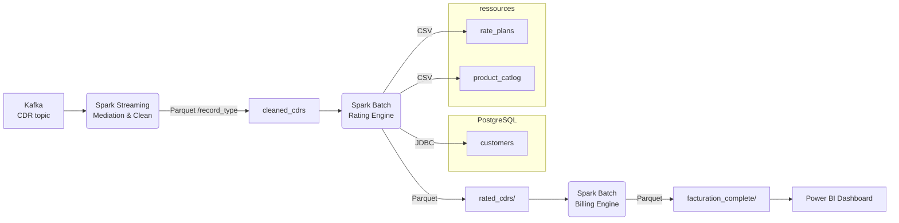

# 📡 Telecom Big-Data Pipeline – Mediation → Rating → Billing → Reporting

> **Goal:** Convert raw network usages (CDR/EDR) into reliable revenue and business KPIs  
> **Stack:** Kafka | Apache Spark (Structured Streaming + Batch) | PostgreSQL | Parquet | Power BI  

---

## 🌐 End-to-End Architecture


## 📂 Project Layout

project-root/

├─ conf/                                         # JARs  
├─ src/  
│  ├─ Synthetic_Data_Generation.py               # Genrator of CDRs 

│  ├─ Streaming_Mediation.py                     # Médiation Spark Structured Streaming  
│  ├─ RatingEngine.ipynb                         # Spark Batch (Rating Engine)  
│  ├─ BillingEngine.ipynb                        # Spark Batch (Billing Engine)  
│  ├─ kafka_streaming.py                         # Kafka Producer  
│  ├─ initialisation_pg.py                       # Initialisation PostgreSQL  
│  └─ reporting.ipynb                            # Job Spark → CSV for BI  
├─ resources/  
│  ├─ product_catalog.csv  
│  └─ rate_plans.csv  
├─ cleaned_cdrs/                                 # Output Médiation (Parquet)  
├─ rated_cdrs/                                   # Output Rating (Parquet)  
├─ billing/                                      # Output Facturation (Parquet)                   
└─ report/                                       # CSV ready for Power BI

## ⚙️ Prerequisites
| Tool                 | Version tested               |
| -------------------- | ---------------------------- |
| **Python**           | 3.9                         |
| **Spark**            | 3.5.x (⚠ driver JDBC ajouté) |
| **Kafka**            | 3.x                          |
| **PostgreSQL**       | ≥ 12                         |

## Installation

1. Clone the repository and navigate to the project folder:
    ```bash
    git clonehttps://github.com/Houssam-Ibnchakroune/Telecom-Data-Pipeline.git
    cd Telecom-Data-Pipeline
    ```


## Configuration

- **Kafka**: Ensure Kafka is installed and running locally.
- **PySpark**:  Modify `bootstrap.servers` in the spark configuration if necessary.
- **PostgreSQL**: Update PostgreSQL connection settings (host, user, password, database) in the code to match your local PostgreSQL setup.

## Usage

1. **Start zookeper**:
    ```bash
    # In one terminal
    .\bin\windows\zookeeper-server-start.bat .\config\zookeeper.properties
    ```
    
2. **Start Kafka-server**:
   ```bash
    # In one terminal
    .\bin\windows\kafka-server-start.bat .\config\server.properties
    ```
   
3. **run the CDR producer**:
   ```bash
    # In one terminal (Python 3.9+ active)
    python kafka_streaming.py
   
4. **run the job Spark Streaming (médiation)**:
   ```bash
    # In one terminal (or in IDE like vs code)
    python Streaming-Based_Mediation.py
   
5. **run the notebooks/ scripts batch de rating,billing and reporting **:
   ```bash
    # In one terminal (or in IDE like vs code)
    python run_pipline.py
6. **Visualize in Power BI**:
    - Start Power BI and read the CSVs files in report/ directory as the data source.
    - Create dashboards for  visualization.


## Example Dashboard in Grafana

In Power BI, create panels to visualize metrics like **Daily Revenue**, **Revenue by Plan and region**, and **Top 10 Data Consumers**.


## Contributeurs

- [Ibnchakroune Houssam](https://github.com/houssam-ibnchakroune) — Lead developer  
- [Kamal Salma](https://github.com/SALMAKAMAL21) — Lead developer
  
---

**Note :** This project is for educational and demonstration purposes. Results may vary depending on the quality and quantity of generated data.
